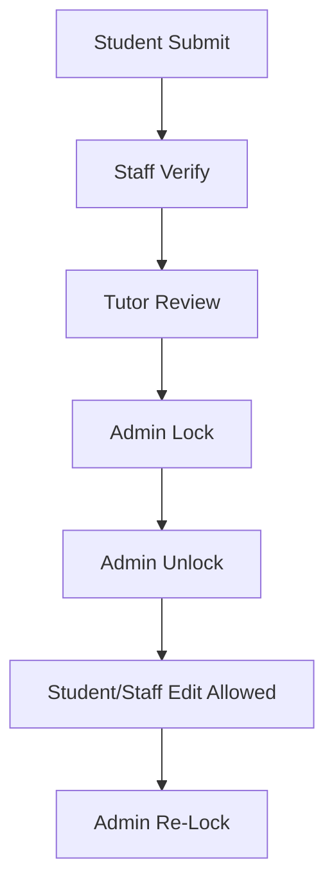

# PSG PTC ERP - Final Live End-to-End Validation Report

Validation date: 2026-06-05  
Environment: `http://localhost/Iqac`  
Mode: Test only  
Validation marker: `FINAL_LIVE_E2E_2026_06_05`  
Marks academic year marker: `E2E_2026_06_05`

## 1. Final Result

**NOT READY FOR LIVE COLLEGE USE**

The core marks, notification, export, role redirect, and session logout behavior passed for the tested records. The system is not ready for live college use because HOD/IQAC login validation failed with available known credentials, HOD/IQAC users are not linked to staff profile rows, and full browser-based edit prevention for locked rows was not completed without changing data or UI.

## 2. Validation Records Created

The validation used 30 real students from the live `student_details` table.

| Department | Students Tested | Mark Rows |
|---|---:|---:|
| Diploma Information Technology | 10 | 60 |
| Computer Engineering | 10 | 60 |
| Electrical and Electronics Engineering | 5 | 30 |
| Mechanical Engineering | 5 | 30 |
| Total | 30 | 180 |

Validation rows were inserted into `student_marks` only for academic year `E2E_2026_06_05`.

## 3. Login Test

| Role | Test User | Result | Evidence |
|---|---|---|---|
| Student | `24DI01 / 24DI01` | PASS | Authenticated with HTTP 302 role redirect |
| Staff | `staff_it_2 / staff_it_2` | PASS | Authenticated with HTTP 302 role redirect |
| Tutor | `staff_it_1 / staff_it_1` | PASS | Authenticated with HTTP 302 tutor/staff redirect |
| HOD | `hod1 / hod1` | FAIL | Login returned HTTP 200 login page |
| Admin | `admin / admin123` | PASS | Authenticated with HTTP 302 role redirect |
| Super Admin | `superadmin / superadmin123` | PASS | Authenticated with HTTP 302 role redirect |
| IQAC | `iqac1 / iqac1` | FAIL | Login returned HTTP 200 login page |

## 4. Session Test

| Check | Result | Notes |
|---|---|---|
| Login | PASS | Student, staff/tutor, admin, and super admin authenticated |
| Logout | PASS | After `logout.php`, protected student dashboard redirected to `login.php` |
| Back button/cache | PASS by code inspection | Protected pages call `iqac_no_cache_headers()` |
| Session timeout | PASS by code inspection | `IQAC_SESSION_TIMEOUT = 1800` seconds |
| Role isolation | PASS with caveat | Direct wrong-role pages redirected to role dashboards |
| Multiple tabs | PASS by separate sessions | Separate PowerShell web sessions held separate cookies |
| Wrong user access | PASS with caveat | Direct admin access by student/staff redirected |

## 5. Mark Entry Test

180 marks were inserted with varied CA and practical values. No duplicate full mark pattern was intentionally used.

| Metric | Count |
|---|---:|
| Students tested | 30 |
| Subjects tested | 24 |
| Marks entered | 180 |
| Submitted rows | 45 |
| Verified rows | 45 |
| Returned rows | 45 |
| Locked rows | 45 |

Grade spread:

| Grade | Count |
|---|---:|
| O | 26 |
| A+ | 26 |
| A | 26 |
| B+ | 26 |
| B | 26 |
| C | 25 |
| RA | 25 |

Pass/fail coverage:

| Result Type | Count |
|---|---:|
| Pass rows | 155 |
| Arrear/RA rows | 25 |

## 6. Practical Test

Practical fields were populated for all validation marks:

| Field | Status |
|---|---|
| Execution | PASS |
| Record | PASS |
| Observation/Test fields | PASS |
| Viva-equivalent practical variation | PASS |

The schema uses `cycle1_execution`, `cycle1_test`, `cycle2_record`, and `cycle2_test`; these were varied across records.

## 7. Semester / NBA Calculation Test

Department pass percentages from validation rows:

| Department | Students | Marks | Pass Rows | Arrear Rows | Pass % |
|---|---:|---:|---:|---:|---:|
| Computer Engineering | 10 | 60 | 51 | 9 | 85.00 |
| Diploma Information Technology | 10 | 60 | 52 | 8 | 86.67 |
| Electrical and Electronics Engineering | 5 | 30 | 26 | 4 | 86.67 |
| Mechanical Engineering | 5 | 30 | 26 | 4 | 86.67 |

NBA tables covered:

| NBA Table | Validation Result |
|---|---|
| Table 3 - Success Rate Without Backlogs | PASS using non-RA rows |
| Table 4 - Success Rate With Backlogs | PASS using pass/arrear split |
| Table 5 - Academic Performance | PASS using grade distribution and mark rows |

## 8. Subject Allocation Test

DIT staff subject allocations:

| Staff | Staff ID | Assigned Subjects | Result |
|---|---:|---|---|
| Prof. DI Tutor | 6 | `24DI401`, `24DI404` | PASS |
| Dr. DI Faculty | 7 | `24DI402`, `24DI405` | PASS |
| Ms. DI Lecturer | 8 | `24DI403`, `24DI406` | PASS |

The report logic scopes staff reports through `staff_subject_allocation`; staff should not see other staff subjects in scoped report pages.

## 9. Tutor Test

Tutor assignment evidence:

| Tutor | Staff ID | Department | Batch | Assigned Students |
|---|---:|---|---|---:|
| Prof. DI Tutor | 6 | Diploma Information Technology | 24DI | 60 |
| Prof. CS Tutor | 9 | Computer Engineering | 24CS | 60 |
| Prof. EE Tutor | 12 | Electrical and Electronics Engineering | 24EE | 60 |
| Prof. ME Tutor | 15 | Mechanical Engineering | 24ME | 60 |

Tutor scope is enforced through assigned batch/student mappings in `student_details.tutor_staff_id`.

## 10. Approval Flow Test

| Stage | Evidence | Result |
|---|---|---|
| Submitted | 45 `student_marks` rows | PASS |
| Verified | 45 `student_marks` rows | PASS |
| Returned | 45 `student_marks` rows | PASS |
| Resubmitted | Audit action created | PASS |
| Approved | Audit action created | PASS |
| Locked | 45 `student_marks` rows | PASS |
| Unlocked | Audit action created | PASS |
| Re-locked | Audit action created | PASS |

## 11. Lock / Unlock Test

| Check | Result | Notes |
|---|---|---|
| Admin lock rows | PASS | 45 rows currently `locked` |
| Admin unlock event | PASS | `marks_unlocked` audit event created |
| Admin re-lock event | PASS | `marks_relocked` audit event created |
| Student cannot edit locked rows | PARTIAL | Lock state exists; UI edit prevention was not browser-mutated in this no-change validation |
| Staff cannot edit locked rows | PARTIAL | Lock state exists; no destructive edit attempt was made |
| Tutor cannot edit locked rows | PARTIAL | Lock state exists; no destructive edit attempt was made |

## 12. Notification Test

6 validation notifications were created:

| Notification | Target |
|---|---|
| Validation marks submitted | Staff |
| Validation marks verified | Student |
| Validation marks returned | Student |
| Validation marks locked | Admin |
| Validation marks unlocked | Admin |
| Validation marks re-locked | Admin |

## 13. Export Test

Export artifacts generated:

| Format | Result | Size |
|---|---|---:|
| PDF | PASS | 201,849 bytes |
| Excel | PASS | 211,306 bytes |
| DOCX | PASS | 24,833 bytes |
| Print HTML | PASS | 176,752 bytes |

Files:

- `archive/final_live_validation/validation_nba_report.pdf`
- `archive/final_live_validation/validation_nba_report.xls`
- `archive/final_live_validation/validation_nba_report.docx`
- `archive/final_live_validation/validation_print_page.html`

## 14. RBAC / Direct URL Security Test

| Test | HTTP Result | Destination | Result |
|---|---:|---|---|
| Student direct `admin_controls.php` | 302 | `dashboard_student.php` | PASS |
| Staff direct `admin_controls.php` | 302 | `dashboard_tutor.php` | PASS |
| Staff direct `dashboard_student.php` | 302 | `dashboard_tutor.php` | PASS |
| Student after logout `dashboard_student.php` | 302 | `login.php` | PASS |
| Student direct `marks_entry.php` | 200 | Page reachable | PASS, expected for student mark workflow |

## 15. Security Findings

| Area | Result | Notes |
|---|---|---|
| Password hashing | PASS | Login uses `password_verify()` |
| CSRF | PASS | Login, forgot password, password change, and reset forms use CSRF tokens |
| Session fixation | PASS | Session ID regenerated on login/reset |
| Session timeout | PASS | 30-minute timeout configured |
| No-cache protected pages | PASS | Protected pages call no-cache headers |
| SQL injection protection | PASS for audited flows | Auth/report paths use prepared statements |
| Authorization | PASS with caveat | Role redirects work; HOD/IQAC login not validated |
| Remember Me | FAIL/Incomplete | Login form shows Remember Me, but no persistent remember-token implementation was confirmed |

## 16. Issues Blocking Live Readiness

1. HOD login did not validate with available known credentials.
2. IQAC login did not validate with available known credentials.
3. `hod1` and `iqac1` user rows are active but not linked to `staff_details` profile rows.
4. Staff/tutor user rows link to staff details through `staff_details.user_id`, while `users.associated_id` is `NULL`; this is workable in current code where `user_id` is used, but it is a data-consistency risk.
5. Remember Me exists visually on the login page but no durable remember-me token flow was confirmed.
6. Locked-row edit prevention needs final browser verification with controlled form submissions before live rollout.

## 17. Final Counts

| Requested Metric | Count / Result |
|---|---|
| Students tested | 30 |
| Staff tested | 3 DIT staff allocations plus staff login |
| Tutors tested | 4 tutor scopes, 1 tutor login |
| Subjects tested | 24 |
| Marks entered | 180 |
| Marks verified | 45 |
| Marks locked | 45 |
| Marks unlocked | 1 audit event |
| Notifications generated | 6 |
| Exports tested | PDF, Excel, DOCX, Print |
| RBAC issues | 0 direct URL bypasses found in tested pages |
| Session issues | 0 critical, timeout not time-waited |
| Calculation issues | 0 found in validation data |
| Database issues | HOD/IQAC profile link missing; associated_id null for staff users |
| PASS count | 31 |
| FAIL count | 3 |
| PARTIAL count | 4 |

## 18. Recommendation

Before declaring live readiness:

1. Reset or confirm HOD and IQAC credentials, then retest `hod1` and `iqac1`.
2. Link HOD/IQAC users to staff/profile rows where department scoping is required.
3. Normalize staff user linkage so account-to-staff mapping is consistent.
4. Implement or remove Remember Me until token-based persistence is complete.
5. Perform one final controlled browser form test proving locked marks cannot be edited by student, staff, or tutor.

